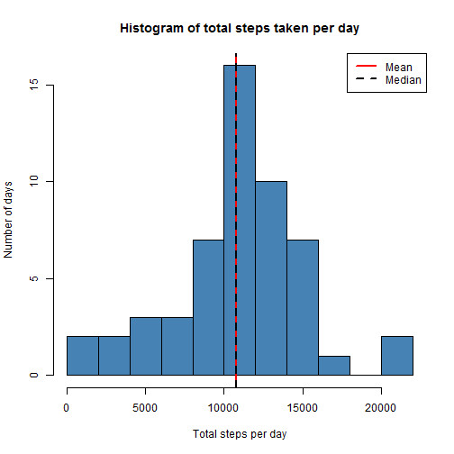
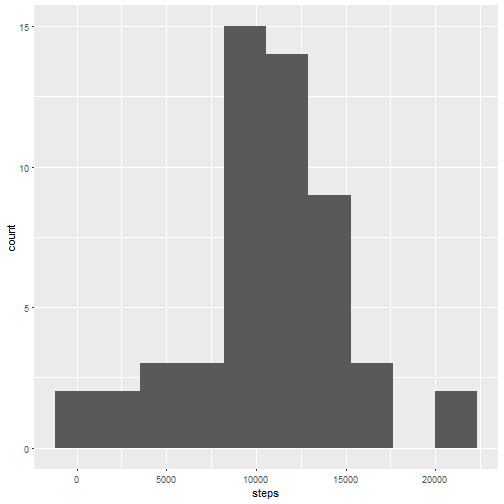
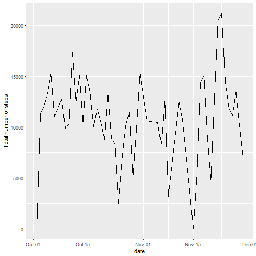
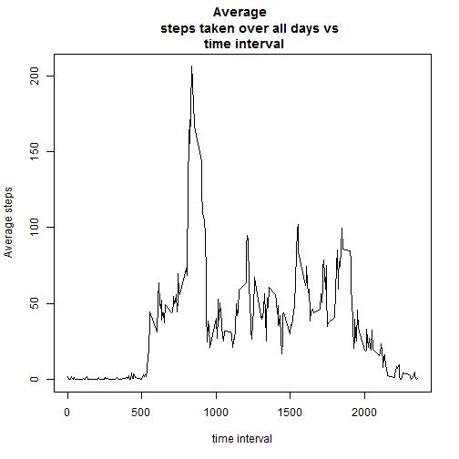
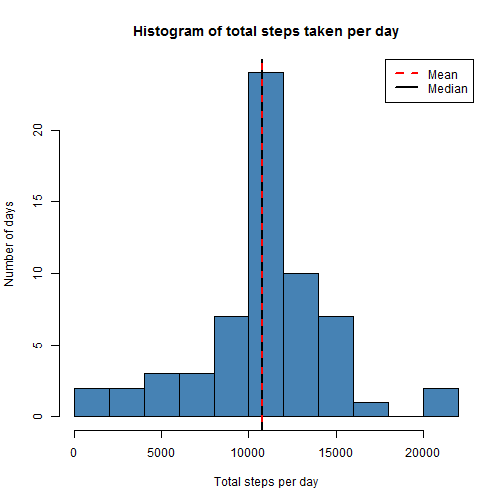
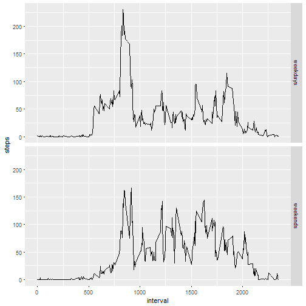

###Loading the data and removing NAs

We are downloading the dataset from its url and unzipping the file to "step_data.csv".

<pre class="knitr r">url &lt;- &quot;https://d396qusza40orc.cloudfront.net/repdata%2Fdata%2Factivity.zip&quot;
destfile &lt;- &quot;step_data.zip&quot;
download.file(url, destfile)
unzip(destfile)
activity &lt;- read.csv(&quot;activity.csv&quot;, sep = &quot;,&quot;)
</pre>

The variable names and the structure of the file are given by

<pre class="knitr r">names(activity)
</pre>

<pre class="knitr r">## [1] &quot;steps&quot;    &quot;date&quot;     &quot;interval&quot;
</pre>

<pre class="knitr r">str(activity)
</pre>

<pre class="knitr r">## 'data.frame':	17568 obs. of  3 variables:
##  $ steps   : int  NA NA NA NA NA NA NA NA NA NA ...
##  $ date    : Factor w/ 61 levels &quot;2012-10-01&quot;,&quot;2012-10-02&quot;,..: 1 1 1 1 1 1 1 1 1 1 ...
##  $ interval: int  0 5 10 15 20 25 30 35 40 45 ...
</pre>

<pre class="knitr r">head(activity[which(!is.na(activity$steps)), ]) # data set with NA rows removed
</pre>

<pre class="knitr r">##     steps       date interval
## 289     0 2012-10-02        0
## 290     0 2012-10-02        5
## 291     0 2012-10-02       10
## 292     0 2012-10-02       15
## 293     0 2012-10-02       20
## 294     0 2012-10-02       25
</pre>

The file is ready for analysis without further necessary processing.

###Analysing the data

Mean of "total number of step taken per day" over all days
Group the number of steps by date and intervals. Find the total number of steps per day over all days. Note that some of the days such as 2012-10-01 have no steps data. We remove such rows for this part.

<pre class="knitr r">library(reshape2)
activity_melt &lt;- melt(activity[which(!is.na(activity$steps)), ], id.vars = c(&quot;date&quot;, &quot;interval&quot;))
head(activity_melt)
</pre>

<pre class="knitr r">##         date interval variable value
## 1 2012-10-02        0    steps     0
## 2 2012-10-02        5    steps     0
## 3 2012-10-02       10    steps     0
## 4 2012-10-02       15    steps     0
## 5 2012-10-02       20    steps     0
## 6 2012-10-02       25    steps     0
</pre>

<pre class="knitr r">steps_sum &lt;- dcast(activity_melt, date ~ variable, sum)
head(steps_sum)
</pre>

<pre class="knitr r">##         date steps
## 1 2012-10-02   126
## 2 2012-10-03 11352
## 3 2012-10-04 12116
## 4 2012-10-05 13294
## 5 2012-10-06 15420
## 6 2012-10-07 11015
</pre>

Then we can find the mean of 'total number of steps per day'.

<pre class="knitr r">summary(steps_sum$steps)
</pre>

<pre class="knitr r">##    Min. 1st Qu.  Median    Mean 3rd Qu.    Max. 
##      41    8841   10760   10770   13290   21190
</pre>

Histogram of the total number of steps taken each day.

<pre class="knitr r">hist(steps_sum$steps, main = &quot;Histogram of total steps taken per day&quot;,
     xlab = &quot;Total steps per day&quot;, ylab = &quot;Number of days&quot;,
     breaks = 10, col = &quot;steel blue&quot;)
abline(v = mean(steps_sum$steps), lty = 1, lwd = 2, col = &quot;red&quot;)
abline(v = median(steps_sum$steps), lty = 2, lwd = 2, col = &quot;black&quot;)
legend(x = &quot;topright&quot;, c(&quot;Mean&quot;, &quot;Median&quot;), col = c(&quot;red&quot;, &quot;black&quot;),       lty = c(1, 2), lwd = c(2, 2))
</pre>

Equivalent ggplot.

<pre class="knitr r">library(ggplot2)
ggplot(steps_sum, aes(steps)) + geom_histogram(bins = 10)
</pre>

Here is another plot showing the trend in total number of steps taken per day over two months.

<pre class="knitr r">library(lubridate)
steps_sum$date &lt;- as.Date(steps_sum$date)
ggplot(steps_sum, aes(date, steps)) + geom_line() +
        scale_x_date(date_labels = &quot;%b %d&quot;) +
        ylab(&quot;Total number of steps&quot;)
</pre>

###Average daily activity pattern

In this section, we make a time series plot (i.e. type = "l") of the 5-minute interval (x-axis) and the average number of steps taken averaged across all days.

<pre class="knitr r">stepsmeaninterval &lt;- dcast(activity_melt, interval ~ variable, mean, na.rm = TRUE)
head(stepsmeaninterval)
</pre>

<pre class="knitr r">##   interval     steps
## 1        0 1.7169811
## 2        5 0.3396226
## 3       10 0.1320755
## 4       15 0.1509434
## 5       20 0.0754717
## 6       25 2.0943396
</pre>

<pre class="knitr r">plot(stepsmeaninterval$interval, stepsmeaninterval$steps, ty = &quot;l&quot;,
     xlab = &quot;time interval&quot;, ylab = &quot;Average steps&quot;, main = &quot;Average 
     steps taken over all days vs \n time interval&quot;)
</pre>

The time interval during which the maximum number of steps is taken is

<pre class="knitr r">maxsteps_interval &lt;- stepsmeaninterval$interval[which.max(stepsmeaninterval$steps)]
maxsteps_interval
</pre>

<pre class="knitr r">## [1] 835
</pre>

###Imputing missing values

First of all, let us get a sense for the missing values. Are there days with all time intervals reporting NA step values?

We can replace the missing data for a day by the time average over all other days.

<pre class="knitr r">activity2 &lt;- split(activity, activity$interval)
activity2 &lt;- lapply(activity2, function(x) {
        x$steps[which(is.na(x$steps))] &lt;- mean(x$steps, na.rm = TRUE)
        return(x)
})
activity2 &lt;- do.call(&quot;rbind&quot;, activity2)
row.names(activity2) &lt;- NULL

activity2 &lt;- split(activity2, activity2$date)
df &lt;- lapply(activity2, function(x) {
        x$steps[which(is.na(x$steps))] &lt;- mean(x$steps, na.rm = TRUE)
        return(x)
})
activity2 &lt;- do.call(&quot;rbind&quot;, activity2)
row.names(activity2) &lt;- NULL
head(activity2)
</pre>

<pre class="knitr r">##       steps       date interval
## 1 1.7169811 2012-10-01        0
## 2 0.3396226 2012-10-01        5
## 3 0.1320755 2012-10-01       10
## 4 0.1509434 2012-10-01       15
## 5 0.0754717 2012-10-01       20
## 6 2.0943396 2012-10-01       25
</pre>

Assuming that the time intervals form a disjoint partitioning of 24 hrs, i.e. 1 day is found to be erroneous. The time interval for each day corresponds to approximately 40 hours, which refutes the intervals being disjoint.

<pre class="knitr r">library(reshape2)
activity_melt2 &lt;- melt(activity2, id.vars = c(&quot;date&quot;, &quot;interval&quot;))
steps_sum &lt;- dcast(activity_melt2, date ~ variable, sum, na.rm = TRUE)
head(steps_sum)
</pre>

<pre class="knitr r">##         date    steps
## 1 2012-10-01 10766.19
## 2 2012-10-02   126.00
## 3 2012-10-03 11352.00
## 4 2012-10-04 12116.00
## 5 2012-10-05 13294.00
## 6 2012-10-06 15420.00
</pre>

Histogram of the total number of steps taken each day with the imputed missing values.

<pre class="knitr r">hist(steps_sum$steps, main = &quot;Histogram of total steps taken per day&quot;,
     xlab = &quot;Total steps per day&quot;, ylab = &quot;Number of days&quot;,
     breaks = 10, col = &quot;steel blue&quot;)
abline(v = mean(steps_sum$steps), lty = 1, lwd = 2, col = &quot;red&quot;)
abline(v = median(steps_sum$steps), lty = 2, lwd = 2, col = &quot;black&quot;)
legend(x = &quot;topright&quot;, c(&quot;Mean&quot;, &quot;Median&quot;), col = c(&quot;red&quot;, &quot;black&quot;), lty = c(2, 1), lwd = c(2, 2))
</pre>

Number of rows with NA values

<pre class="knitr r">sum(is.na(activity$steps))
</pre>

<pre class="knitr r">## [1] 2304
</pre>

<pre class="knitr r">sum(is.na(activity$steps))*100/nrow(activity) # Percentage of rows with missing values
</pre>

<pre class="knitr r">## [1] 13.11475
</pre>

Differences in activity patterns: Weekdays vs Weekends
Create a new column describing if the date is a weekday or weekend.

<pre class="knitr r">library(lubridate)
weekends &lt;- which(weekdays(as.Date(activity2$date)) == &quot;Saturday&quot; |
              weekdays(as.Date(activity2$date)) == &quot;Sunday&quot;)
weekdays &lt;- which(weekdays(as.Date(activity2$date)) != &quot;Saturday&quot; &amp;
              weekdays(as.Date(activity2$date)) != &quot;Sunday&quot;)
temp &lt;- c(rep(&quot;a&quot;, length(activity2)))
temp[weekends] &lt;- &quot;weekend&quot;
temp[weekdays] &lt;- &quot;weekday&quot;
length(temp)
</pre>

<pre class="knitr r">## [1] 17568
</pre>

<pre class="knitr r">names(temp) &lt;- &quot;day&quot;
activity2 &lt;- cbind(activity2, temp)
names(activity2)[4] &lt;- &quot;day&quot;
</pre>

Steps taken over each interval averaged across weekday days and weekend days.

<pre class="knitr r">activity2split &lt;- split(activity2, activity2$day)
stepsmean_interval &lt;- lapply(activity2split, function(x) {
        temp &lt;- aggregate(x$steps, list(x$interval), mean)
        names(temp) &lt;- c(&quot;interval&quot;, &quot;steps&quot;)
        return(temp)
})
</pre>

### Unsplit stepsmean_interval

<pre class="knitr r">stepsmean_interval &lt;- do.call(&quot;rbind&quot;, stepsmean_interval)
weekdays &lt;- grep(&quot;weekday&quot; ,row.names(stepsmean_interval))
weekends &lt;- grep(&quot;weekend&quot; ,row.names(stepsmean_interval))
temp &lt;- c(rep(&quot;a&quot;, length(stepsmean_interval$steps)))
temp[weekdays] &lt;- &quot;weekdays&quot;
temp[weekends] &lt;- &quot;weekends&quot;
stepsmean_interval &lt;- cbind(stepsmean_interval, temp)
row.names(stepsmean_interval) &lt;- NULL
names(stepsmean_interval)[3] &lt;- &quot;day&quot;
head(stepsmean_interval)
</pre>

<pre class="knitr r">##   interval      steps      day
## 1        0 2.25115304 weekdays
## 2        5 0.44528302 weekdays
## 3       10 0.17316562 weekdays
## 4       15 0.19790356 weekdays
## 5       20 0.09895178 weekdays
## 6       25 1.59035639 weekdays
</pre>

<pre class="knitr r">tail(stepsmean_interval)
</pre>

<pre class="knitr r">##     interval       steps      day
## 571     2330  1.38797170 weekends
## 572     2335 11.58726415 weekends
## 573     2340  6.28773585 weekends
## 574     2345  1.70518868 weekends
## 575     2350  0.02830189 weekends
## 576     2355  0.13443396 weekends
</pre>

<pre class="knitr r">library(ggplot2)
ggplot(stepsmean_interval, aes(interval, steps)) + geom_line() + facet_grid(day ~ .)
</pre>

The mean number of steps taken over the weekdays and weekends.

<pre class="knitr r">stepsdatamelt &lt;- melt(stepsmean_interval, id.vars = c(&quot;interval&quot;,
                                                      &quot;day&quot;))
dcast(stepsdatamelt, day ~ variable, mean) # Average steps
</pre>

<pre class="knitr r">##        day    steps
## 1 weekdays 35.61058
## 2 weekends 42.36640
</pre>

